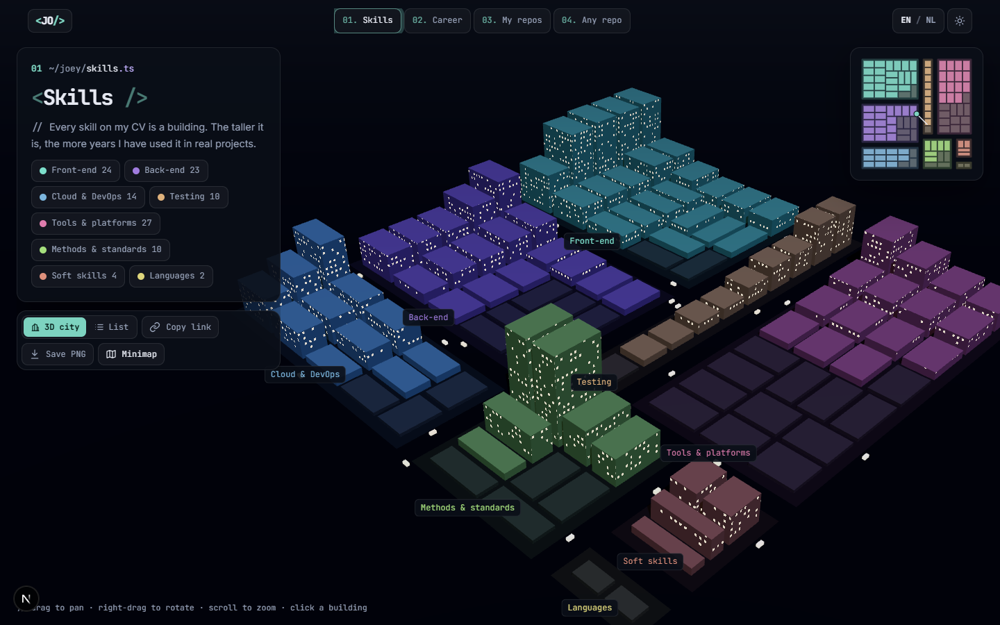

# DevCity · Joey Oosenbrug

[](https://devcity.joeyoosenbrug.nl)

My CV and GitHub, rendered as cities you can fly around. Every skill, job, repository and file becomes a building: the taller it is, the more there is behind it. And you can point it at **any public GitHub repository**.

**Live:** [devcity.joeyoosenbrug.nl](https://devcity.joeyoosenbrug.nl) · **Portfolio:** [joeyoosenbrug.nl](https://joeyoosenbrug.nl)

It is the 3D companion to my [portfolio](https://github.com/joeykwispel/Portfolio) and shares its design language: dark navy, teal and violet, Inter and JetBrains Mono, glass panels and code-style headings. English and Dutch.

## Four cities

| Layer        | District                                     | Building                  | Height                  |
| ------------ | -------------------------------------------- | ------------------------- | ----------------------- |
| **Skills**   | Skill category                               | One skill                 | Years of hands-on use   |
| **Career**   | Work / education, along a timeline boulevard | One job or course         | Technologies used there |
| **My repos** | One of my repositories, plus contributions   | One language in that repo | Commit count            |
| **Any repo** | Top-level folder (nested folders as blocks)  | One file                  | File size               |

Years of experience are derived from the roles in `cv.json` (overlapping roles count once) and recalculated in the browser, so the skills city keeps growing without a redeploy.

## Features

- **Day and night** follow the theme and fade into each other; at night the windows light up.
- **Traffic** on the streets, **smog** over repositories nobody pushed to in a while.
- **Minimap** with the camera position; click to fly there.
- **Save PNG** of the current view.
- **Shareable URLs:** selection, focused district and view are in the link (`/en/?select=React`), and the language switcher keeps them.
- **List view** for every layer: the accessible, keyboard-first equivalent of the canvas. Escape closes panels, `prefers-reduced-motion` stops all animation, and every layer passes axe WCAG 2.2 AA checks in both languages and themes.
- **Any repo** handles huge repositories (GitHub's truncated trees are walked folder by folder within a request budget), caches everything in IndexedDB with ETags so revisits cost no rate limit, and shows how many GitHub requests you have left.

## Roadmap

- [x] **1.** Monorepo scaffold, CI, GitHub Pages deploy, custom domain
- [x] **2.** `city-layout` engine + Skills layer from `cv.json`
- [x] **3.** Dutch/English (next-intl) and the layer switcher
- [x] **4.** Career layer: roles and education on a timeline boulevard
- [x] **5.** My Repos layer, generated at build time by `scripts/build-data.ts`
- [x] **6.** `github-client` + Any Repo layer (TanStack Query, IndexedDB cache, rate-limit UI)
- [x] **7.** Accessibility, list view, share URLs, Storybook
- [x] **8.** Polish: day/night, minimap, PNG export, smog, traffic
- [x] **9.** Hono edge proxy on Cloudflare Workers (optional, see below)

## Tech stack

| Area      | Choice                                                                       |
| --------- | ---------------------------------------------------------------------------- |
| Framework | Next.js (App Router, static export), React, TypeScript                       |
| 3D        | three.js, react-three-fiber, drei; one instanced mesh per city               |
| Layout    | `@devcity/city-layout`: pure TypeScript, d3-hierarchy treemaps, no React     |
| GitHub    | `@devcity/github-client`: Zod-validated, ETags, rate limits, truncated trees |
| Data      | TanStack Query persisted to IndexedDB; `cv.json` validated with Zod          |
| UI        | Tailwind CSS with the portfolio tokens, Shadcn UI (Radix), Zustand           |
| i18n      | next-intl, `/en` and `/nl`, typed messages, `Intl` for numbers and dates     |
| Proxy     | Hono on Cloudflare Workers                                                   |
| Quality   | Vitest, Playwright + axe, Storybook, ESLint, Prettier, GitHub Actions        |
| Hosting   | GitHub Pages on a custom subdomain                                           |

## Project structure

```
apps/web/
  app/[locale]/           Routes per language: skills (/), career, repos, any-repo
  components/             Header, layer shell, list view, toolbar, Shadcn UI
  components/scene/       Shared 3D scene: buildings, atmosphere, traffic, smog, minimap
  features/               One folder per layer
  data/cv.json            CV content: categories, skills, roles, education (en/nl)
  messages/               en.json and nl.json
  public/data/repos.json  My Repos snapshot, refreshed on every deploy
apps/proxy/               Optional GitHub proxy (Hono, Cloudflare Workers)
packages/city-layout/     Layout engine for all four cities, unit tested
packages/github-client/   Typed GitHub client, unit tested
scripts/build-data.ts     Fetches the My Repos data at build time
tests/e2e/                Playwright + axe end-to-end tests
.github/workflows/        ci.yml, deploy.yml (Pages), deploy-proxy.yml (Workers)
```

## Run it locally

Requires Node 24 and pnpm 11 (`corepack enable`).

```sh
pnpm install
cp .env.example apps/web/.env.local   # then fill in values
pnpm dev                              # http://localhost:3000
```

| Command                                        | What it does                                                                     |
| ---------------------------------------------- | -------------------------------------------------------------------------------- |
| `pnpm dev`                                     | Dev server with hot reload                                                       |
| `pnpm build`                                   | Static export to `apps/web/out`                                                  |
| `pnpm data`                                    | Refresh `repos.json` from GitHub (uses `GH_DATA_TOKEN` if set)                   |
| `pnpm test`                                    | Unit tests (layouts, GitHub client, CV schema, proxy)                            |
| `pnpm test:e2e`                                | Playwright + axe against the build (`PW_CHANNEL=chrome` to use installed Chrome) |
| `pnpm --filter @devcity/web storybook`         | Storybook on http://localhost:6006                                               |
| `pnpm dev:proxy`                               | The proxy locally with Wrangler                                                  |
| `pnpm lint` / `pnpm typecheck` / `pnpm format` | ESLint / TypeScript / Prettier                                                   |

### Editing the CV

Everything in the Skills and Career cities comes from [`apps/web/data/cv.json`](apps/web/data/cv.json):

- `categories`: skill districts, with a hue and an English/Dutch label
- `skills`: one building each; `id` is the name used in role stacks
- `roles`: work history with title, summary and bullets in both languages; a skill's height is the total time of the roles that list it in `stack`
- `education`: degrees and courses for the other side of the career boulevard

The Zod schema checks cross-references too, so a typo in a role's stack, an unknown category, a duplicate id or a bad date fails `pnpm test` and `pnpm build` instead of shipping.

## Environment variables

All configuration comes from env vars; see [`.env.example`](.env.example). Local values go in `apps/web/.env.local` (git-ignored).

Anything prefixed `NEXT_PUBLIC_` is inlined into the static bundle and visible to every visitor, so **secrets never use that prefix**.

| Name                           | Kind   | Where in GitHub      | Purpose                                                  |
| ------------------------------ | ------ | -------------------- | -------------------------------------------------------- |
| `NEXT_PUBLIC_SITE_URL`         | public | Actions **variable** | Canonical URL, `https://devcity.joeyoosenbrug.nl`        |
| `NEXT_PUBLIC_BASE_PATH`        | public | Actions **variable** | Leave unset with a custom domain; `/devcity` without one |
| `NEXT_PUBLIC_GITHUB_USERNAME`  | public | Actions **variable** | User shown in the My Repos layer                         |
| `NEXT_PUBLIC_GITHUB_PROXY_URL` | public | Actions **variable** | URL of the proxy; unset = visitors call GitHub directly  |
| `GH_DATA_TOKEN`                | secret | Actions **secret**   | Read-only PAT for `pnpm data` at build time              |
| `CLOUDFLARE_API_TOKEN`         | secret | Actions **secret**   | Only for the proxy deploy                                |
| `CLOUDFLARE_ACCOUNT_ID`        | secret | Actions **secret**   | Only for the proxy deploy                                |
| `GH_PROXY_TOKEN`               | secret | Actions **secret**   | Read-only PAT the proxy uses; stored as a Worker secret  |

Set them under **Settings → Secrets and variables → Actions**.

## Deployment

1. **Settings → Pages → Source:** GitHub Actions.
2. **Settings → Pages → Custom domain:** `devcity.joeyoosenbrug.nl`, then **Enforce HTTPS** once the certificate is issued.
3. DNS: a `CNAME` record for `devcity` pointing to `joeykwispel.github.io.`
4. Every push to `main` runs `deploy.yml`: it refreshes `repos.json`, builds `apps/web/out` and publishes it.

### Optional: the GitHub proxy

Without it, visitors of the Any Repo layer use their own anonymous GitHub budget of 60 requests per hour (a repository usually costs 2). With it, they share a token with 5,000 per hour, and the edge caches every answer for 10 minutes.

1. Create a Cloudflare account and an API token with **Edit Cloudflare Workers** permission.
2. Add the `CLOUDFLARE_API_TOKEN`, `CLOUDFLARE_ACCOUNT_ID` and `GH_PROXY_TOKEN` secrets. The next push to `apps/proxy` (or a manual run of **Deploy proxy**) deploys it.
3. Set `NEXT_PUBLIC_GITHUB_PROXY_URL` to the Worker URL and redeploy the site.

The proxy only answers the handful of read-only endpoints DevCity uses, only to the origins in `apps/proxy/wrangler.jsonc`, and never returns the token.

## License

The **code** is released under the [MIT License](LICENSE), so feel free to build your own city from it.

Third-party parts (three.js, react-three-fiber, drei, d3-hierarchy, Next.js, React, TanStack Query, Radix, Hono and the other npm dependencies, plus the Inter and JetBrains Mono fonts under the SIL Open Font License, and GitHub's language colours from github-linguist) keep their own permissive licenses, all compatible with MIT.

The **content** is not covered by that license: my CV data in `apps/web/data/cv.json`, `apps/web/public/data/repos.json`, my name and the preview image (`docs/preview.png`) remain © Joey Oosenbrug. If you fork this, replace `cv.json` with your own and run `pnpm data` with your GitHub username.
